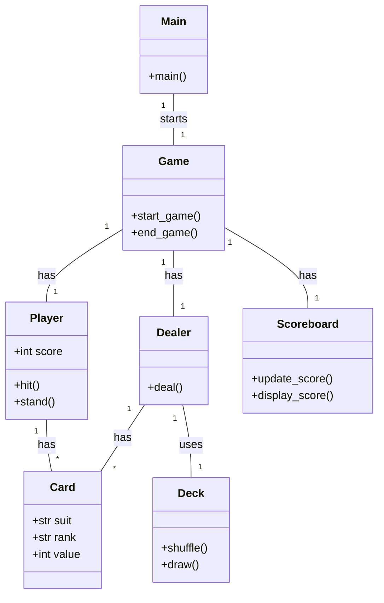
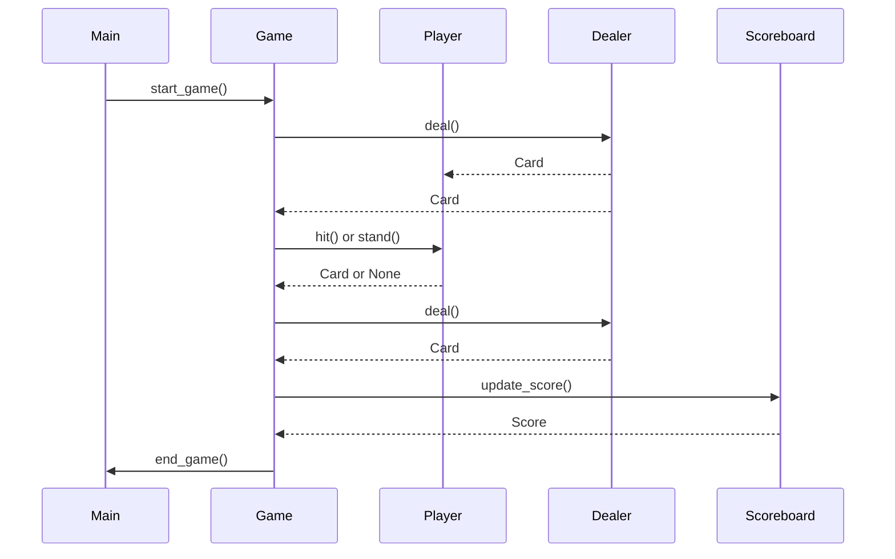

## Implementation approach
We will use Python's built-in modules to implement the game. The `random` module will be used for card dealing. The `os` module will be used to clear the console for a fresh view each round. The `enum` module will be used to define card suits and ranks. The `collections` module will be used to keep track of the player's score. The game logic will be encapsulated in classes and functions for easy maintenance and extension.

## Python package name
```python
"cli_blackjack"
```

## File list
```python
[
    "main.py",
    "game.py",
    "player.py",
    "dealer.py",
    "card.py",
    "deck.py",
    "scoreboard.py"
]
```

## Data structures and interface definitions


## Program call flow


## Anything UNCLEAR
The requirement is clear to me.